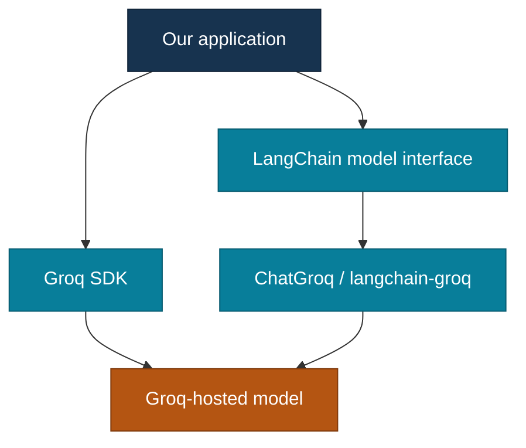

# 01 — Models

[Home](../../README.md) · [LangChain chapters](../README.md) · [Previous: Orientation](../00-orientation/README.md)

## On this page

- [What exactly is a model here?](#what-exactly-is-a-model-here)
- [Where LangChain fits](#where-langchain-fits)
- [What our first comparison proved](#what-our-first-comparison-proved)
- [One answer, a stream, or several answers](#one-answer-a-stream-or-several-answers)
- [What comes back from a model](#what-comes-back-from-a-model)
- [Can we swap providers easily?](#can-we-swap-providers-easily)
- [Experiments](#experiments)
- [Interview questions](#interview-questions)
- [References](#references)

## What exactly is a model here?

Think of the model as the part that produces a response from the input we give
it. The **provider** makes that model available, usually through an API. Its
**SDK** is one way for our Python code to call that API.

A model and a provider are not always the same thing. In our first recorded run,
the requested model was `openai/gpt-oss-20b`, while Groq was the inference
provider serving the request.

The visible sentence is only one part of the experiment. We also care about how
our code invoked the model, which Python object came back, and which usage or
provider details were available.

## Where LangChain fits

LangChain puts a common model interface between our application and supported
providers. A provider integration translates that interface into the underlying
provider call.

Our first real wrapper experiment used Groq:

```python
from langchain_groq import ChatGroq

model = ChatGroq(model="openai/gpt-oss-20b")
reply = model.invoke("Explain what an API is in one simple sentence.")

print(type(reply).__name__)
print(reply.content)
```

The important abstraction is not that Groq disappeared. We still constructed a
`ChatGroq` provider integration. The change is that the application-facing call
became `model.invoke(...)`, and the returned LangChain object was an `AIMessage`.

Here is the route each call takes:



The two routes are alternatives from the perspective of our application. An
integration may use provider APIs or SDK behavior internally; the important
question for us is which interface **our code** is written against.

[Explore the request journey visually](https://shendesuchit.github.io/agentic-ai-learning/01-langchain/01-models/visual-guide.html#the-request-journey).

**Interview angle:** LangChain standardizes common interaction patterns; it does
not make providers or their capabilities identical.

## What our first comparison proved

We used the same prompt, the same provider, and the same requested model in both
experiments:

```text
Explain what an API is in one simple sentence.
```

Recorded on 27 September 2026:

| Observation | Direct Groq SDK | LangChain wrapper |
| --- | --- | --- |
| Provider | Groq | Groq |
| Requested model | `openai/gpt-oss-20b` | `openai/gpt-oss-20b` |
| Input tokens | 81 | 81 |
| Python response type | `ChatCompletion` | `AIMessage` |
| Application call | `client.chat.completions.create(...)` | `model.invoke(...)` |
| Answer access | `response.choices[0].message.content` | `response.content` |
| Common usage view | Provider usage object | `response.usage_metadata` |
| Provider details | SDK response fields | `response.response_metadata` |

The generated answers were similar but not identical. That is expected: one
request is not a deterministic equivalence test and is not a benchmark.

The direct call reported 91 completion tokens, including 63 reasoning tokens.
The LangChain call reported 67 output tokens, including 38 reasoning tokens.
Those numbers describe two different generations; they do **not** show that
LangChain is faster or cheaper.

### What became common

After a provider-specific model object exists, our code can use a common
operation:

```python
response = model.invoke(input)
```

The response is represented as a LangChain message rather than the provider SDK
object.

### What stayed provider-specific

Provider selection, credentials, supported model IDs, optional parameters,
feature support, rate limits, pricing, and some metadata still belong to the
provider/integration boundary.

This is the useful mental model:

```text
Common interface
      |
      v
LangChain model abstraction
      |
      v
Provider integration
      |
      v
Provider API / hosted model
```

## One answer, a stream, or several answers

The model interface gives us different ways to receive results:

| Method | What we ask for | What our code handles |
| --- | --- | --- |
| `invoke(input)` | One input | One complete response. |
| `stream(input)` | One input | Chunks arriving over time. |
| `batch(inputs)` | Several independent inputs | A set of complete responses. |
| `ainvoke`, `astream`, `abatch` | The corresponding work in async code | Awaited results or an async stream. |

Streaming is useful when we want to show progress before the whole answer is
ready. Its chunks need to be assembled or handled as they arrive; an interrupted
stream may leave a partial answer. `batch` runs independent model calls with
client-side parallelism. It is different from a provider's separate batch API.

**Interview angle:** “Batch” describes handling several inputs. “Async” describes
how the application waits for work. They answer different questions.

## What comes back from a model

With a chat model, `invoke` normally returns an `AIMessage`, not just a Python
string.

Our actual wrapper run exposed three useful views:

```text
AIMessage
├── content
├── usage_metadata
└── response_metadata
```

| Field or idea | Why it matters |
| --- | --- |
| `content` | The answer content returned by the model. |
| `usage_metadata` | A normalized place for token usage when the integration supplies it. |
| `response_metadata` | Provider/model details that are still useful even though we used an abstraction. |
| `tool_calls` | Requests to call tools; these are not the tool results themselves. |

In our Groq run, `usage_metadata` reported `input_tokens`, `output_tokens`,
`total_tokens`, and reasoning-token details. `response_metadata` preserved
information including the model name, finish reason, service tier, and
`model_provider: groq`.

That gives LangChain an important balance:

**common fields for application code + access to provider details when needed.**

[Explore the AIMessage diagram](https://shendesuchit.github.io/agentic-ai-learning/01-langchain/01-models/visual-guide.html#inside-an-aimessage).

`stream` returns message chunks rather than a single finished message. We will
test that separately instead of assuming its behavior from `invoke`.

## Can we swap providers easily?

We can often keep a call such as:

```python
model.invoke(...)
```

while changing the provider integration. That is useful, but it is not a promise
that providers are interchangeable.

Typical provider-specific integrations include:

| Provider route | LangChain class | Integration package |
| --- | --- | --- |
| OpenAI | `ChatOpenAI` | `langchain-openai` |
| Gemini | `ChatGoogleGenerativeAI` | `langchain-google-genai` |
| Groq | `ChatGroq` | `langchain-groq` |
| OpenRouter | `ChatOpenRouter` | `langchain-openrouter` |

Only the **Groq path** has been executed in this repository at this checkpoint.
The others remain reference paths until we install their integrations and run
them.

Providers can differ in available models, settings, tool calling, structured
output, streaming details, response metadata, rate limits, and pricing. We check
features against the selected provider instead of assuming that a shared method
name guarantees identical behavior.

## Experiments

### 01 — Direct provider baseline — completed with Groq

[Read the experiment](experiments/01-provider-specific-baseline/README.md).

Purpose: experience the provider SDK response before introducing LangChain.

Observed response type:

```text
ChatCompletion
```

### 02 — LangChain model wrapper — completed with Groq

[Read the experiment](experiments/02-langchain-model-wrapper/README.md).

Purpose: repeat the same request through `ChatGroq`, then compare the
application-facing call and response object.

Observed response type:

```text
AIMessage
```

### Next experiments

1. Study Messages deliberately: system, human, AI, tool messages, metadata, and history.
2. Change model settings and verify which settings the chosen provider actually supports.
3. Inspect complete responses and streamed chunks.
4. Try a second provider and record what stays common and what changes.
5. Inspect a useful failure instead of documenting only the happy path.

## Interview questions

| Question | Short answer |
| --- | --- |
| What does LangChain standardize for models? | Common interaction patterns such as model invocation and message handling, implemented through provider integrations. |
| Does LangChain remove provider differences? | No. Model availability, parameters, capabilities, limits, pricing, and some metadata remain provider-specific. |
| What is the difference between an interface and an integration here? | The interface is what application code calls; the integration translates that interface to a specific provider. |
| Why establish a direct SDK baseline first? | It shows the provider-native call and response shape, making the abstraction added by LangChain visible. |
| What changed in our Groq comparison? | `ChatCompletion` became `AIMessage`, the call became `model.invoke(...)`, and common fields such as `content` and `usage_metadata` became available. |
| Is an `AIMessage` only the answer text? | No. It can also carry tool-call requests and metadata. |
| Why keep `response_metadata` if LangChain normalizes responses? | Some provider/model details remain useful and cannot or should not be flattened into one common schema. |
| Why did two calls with the same prompt return slightly different answers? | Model generation can vary between requests; a single pair of calls is not a deterministic equivalence test. |
| Can we claim LangChain was faster from our two runs? | No. The generations used different output/reasoning token counts and one run per route is not a benchmark. |
| Is the model name the same as the provider? | Not necessarily. Our requested model was `openai/gpt-oss-20b`, while Groq served the inference request. |
| How is `stream` different from `invoke`? | `invoke` returns a complete message; `stream` yields chunks that the application handles over time. |
| Is `batch` the same as async? | No. Batch is about multiple inputs; async is about how the application waits for work. |

## References

- [LangChain models](https://docs.langchain.com/oss/python/langchain/models)
- [LangChain messages](https://docs.langchain.com/oss/python/langchain/messages)
- [LangChain Groq integration](https://docs.langchain.com/oss/python/integrations/chat/groq)
- [Groq model documentation](https://console.groq.com/docs/model/openai/gpt-oss-20b)

[Back to top](README.md) · Next chapter: Messages
