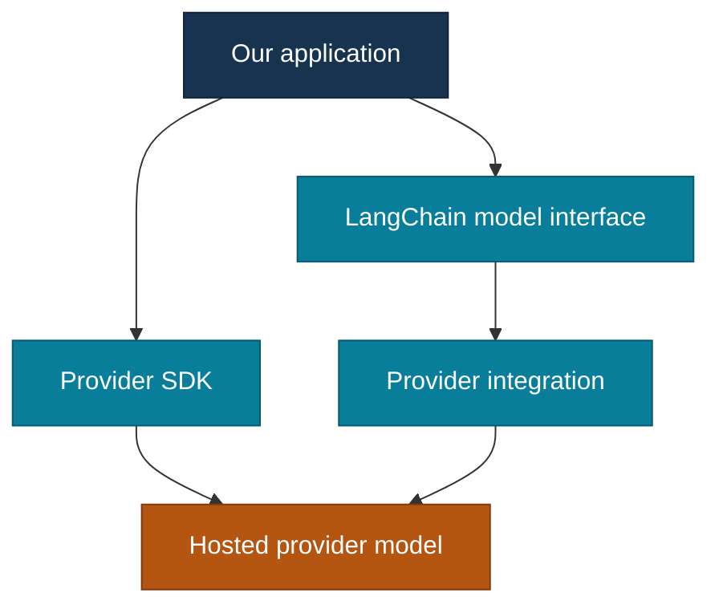

# 01 — Models

[Home](../../README.md) · [LangChain chapters](../README.md) · [Previous: Orientation](../00-orientation/README.md)

## On this page

- [What exactly is a model here?](#what-exactly-is-a-model-here)
- [Where LangChain fits](#where-langchain-fits)
- [One answer, a stream, or several answers](#one-answer-a-stream-or-several-answers)
- [What comes back from a model](#what-comes-back-from-a-model)
- [Can we swap providers easily?](#can-we-swap-providers-easily)
- [Examples we will explore](#examples-we-will-explore)
- [Interview questions](#interview-questions)
- [References](#references)

## What exactly is a model here?

Think of the model as the part that produces a response from the input we give it. The **provider** makes that model available, usually through an API. Its **SDK** is one way for our Python code to call that API.

For a first experiment, we could send a simple question and print the answer. The interesting part is not only the sentence we see on screen. We also want to understand how we sent the request and what the response object contains.

## Where LangChain fits

LangChain puts a common model interface between our application and supported providers. We can create a chat model through `init_chat_model` or through a provider-specific class. Either way, the provider integration does the work of connecting that interface to the provider.

The shape below uses placeholders because a provider and model have not been selected for the practical examples yet. It is **illustrative code**, not an experiment that has already been run:

```python
from langchain.chat_models import init_chat_model

model = init_chat_model("your-model-name", model_provider="your-provider")
reply = model.invoke("Explain an API in one sentence.")
print(reply.content)
```

To run it, we will choose a real model, install its provider integration, and configure the required credentials. We can then compare this call with the same task through the provider SDK.

Here is the route each call takes:



The two routes are alternatives for our application. An integration may use a provider SDK internally; the point here is where **our code** interacts with each route.

[Explore the three interactive Models diagrams](https://shendesuchit.github.io/agentic-ai-learning/01-langchain/01-models/visual-guide.html) for the request journey, delivery methods, and response fields.

**Interview angle:** A common interface helps us write similar calling code. It does not mean every provider offers the same features.

## One answer, a stream, or several answers

The model interface gives us different ways to receive results:

| Method | What we ask for | What our code handles |
| --- | --- | --- |
| `invoke(input)` | One input | One complete response. |
| `stream(input)` | One input | Chunks arriving over time. |
| `batch(inputs)` | Several independent inputs | A set of complete responses. |
| `ainvoke`, `astream`, `abatch` | The corresponding work in async code | Awaited results or an async stream. |

Streaming is useful when we want to show progress before the whole answer is ready. Its chunks need to be assembled or handled as they arrive; an interrupted stream may leave a partial answer. `batch` runs independent model calls with client-side parallelism. It is different from a provider's separate batch API. Concurrency and rate limits matter once we try larger batches.

**Interview angle:** “Batch” describes handling several inputs. “Async” describes how the application waits for work. They answer different questions, and we can combine them.

## What comes back from a model

With a chat model, `invoke` normally returns an `AIMessage`, not just a Python string. Its visible answer may be in `content`, but there can be more to inspect:

| Field or idea | Why it matters |
| --- | --- |
| `content` | The answer content; it may have more than a simple text form. |
| `tool_calls` | Requests to call tools; these are not the tool's results. |
| `response_metadata` | Provider or model details, when available. |
| `usage_metadata` | Token usage details, when the integration supplies them. |

`stream` returns `AIMessageChunk` objects, which represent pieces of the response. We should not assume every chunk contains a complete sentence or that all providers return identical metadata.

Imagine the model requests `get_weather(location="Pune")`. That request may appear in `tool_calls`. Our application or an agent loop still has to run `get_weather`, handle any failure, and send its result back if another model response is needed.

**Interview angle:** If someone asks whether a model response is “just text,” explain the response object and why ignoring tool calls or metadata can hide useful behavior.

## Can we swap providers easily?

We can often keep the `invoke` call while changing the model configuration or integration. That is useful for comparison, but it is not a promise of identical output.

Providers can differ in available models, settings, tool calling, structured output, streaming details, and response metadata. We will check a feature against the selected provider rather than assume that a shared method name guarantees support.

## Examples we will explore

The [direct SDK baseline](experiments/01-provider-specific-baseline/README.md) is ready for OpenAI, Gemini, Groq, or OpenRouter. Pick one provider that you can access and run a single request. **No model calls or measurements have been recorded in this repository yet.**

1. Call one provider directly through its SDK, then make the same request through LangChain.
2. Inspect the complete response, streamed chunks, and results for several inputs.
3. Change model settings and see which ones the chosen provider actually supports.
4. Try a second provider if access is available, and describe what stayed the same and what changed.
5. Inspect a useful failure, such as an unsupported setting or an interrupted stream.

We will record the real model, versions, inputs, and results once we run these examples. That will let us separate what the interface promises from what we actually observed.

## Interview questions

| Question | Short answer |
| --- | --- |
| What does LangChain standardize for models? | A common way to initialize, call, and handle supported chat models, with provider integrations behind the interface. |
| How is `stream` different from `invoke`? | `invoke` returns a complete message; `stream` provides chunks that the application handles over time. |
| Is `batch` the same as async? | No. Batch is about multiple inputs; async is about waiting without blocking the same way. |
| Is an `AIMessage` only the answer text? | No. It can also carry tool-call requests and available metadata. |
| Has a tool run when `tool_calls` is present? | No. A client-side tool still has to be executed by the application or agent loop. |
| Will the same code behave identically with another provider? | No. Check supported features, configuration, output details, and observed behavior. |

## References

- [LangChain models](https://docs.langchain.com/oss/python/langchain/models)
- [LangChain messages](https://docs.langchain.com/oss/python/langchain/messages)
- [LangChain installation and provider integrations](https://docs.langchain.com/oss/python/langchain/install)

[Back to top](README.md) · Next chapter: Messages
